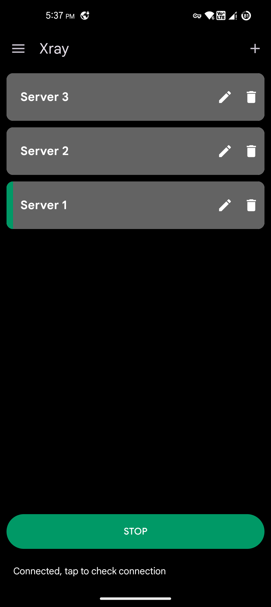
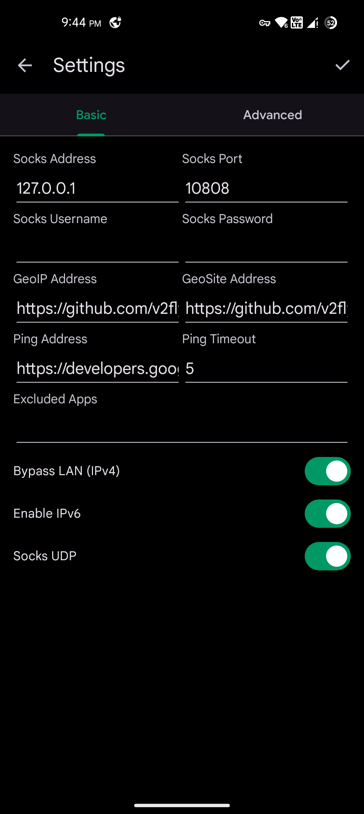
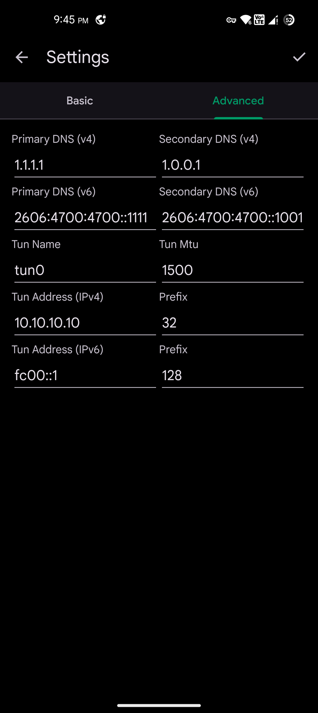

# Xray
  
This is a simple GUI client for <a href="https://github.com/XTLS/Xray-core">XTLS/Xray-core</a> 
Also you can use it independent of Xray-core just for your socks proxy (Like SocksDroid)

# Screenshots

# APK variants guide
- arm32 => versionCode + 1
- arm64 => versionCode + 2
- x86 => versionCode + 3
- amd64 => versionCode + 4

# Download
  

